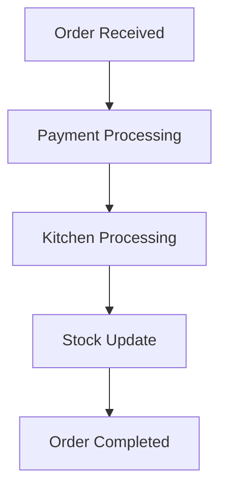

# GitHub Setup Guide

## 🎯 Langkah-langkah Upload ke GitHub

### Step 1: Buat Repository di GitHub

1. Login ke GitHub (https://github.com)
2. Klik tombol **"+"** di pojok kanan atas → **"New repository"**
3. Isi form:
   - **Repository name**: `gofood-multithreading`
   - **Description**: `Go-Food Multithreading System - Operating Systems Final Project`
   - **Visibility**: Public atau Private (terserah)
   - **JANGAN** centang "Initialize this repository with a README" (karena kita sudah punya)
4. Klik **"Create repository"**

### Step 2: Setup Git di Local (WSL/Ubuntu)

```bash
# Navigate ke project directory
cd "c:\Users\Admin\OneDrive\Desktop\Kuliah Guwa\SO\UAS\gofood-multithreading"

# Atau di WSL:
cd /mnt/c/Users/Admin/OneDrive/Desktop/Kuliah\ Guwa/SO/UAS/gofood-multithreading

# Configure git (jika belum)
git config --global user.name "Your Name"
git config --global user.email "your.email@example.com"

# Initialize git repository
git init

# Add all files
git add .

# Commit
git commit -m "Initial commit: Go-Food Multithreading System"
```

### Step 3: Connect ke GitHub Repository

```bash
# Add remote repository (ganti [username] dengan username GitHub Anda)
git remote add origin https://github.com/[username]/gofood-multithreading.git

# Verify remote
git remote -v

# Push to GitHub
git branch -M main
git push -u origin main
```

**Jika diminta username & password**:
- Username: GitHub username Anda
- Password: **JANGAN** gunakan password GitHub, gunakan **Personal Access Token**

### Step 4: Create Personal Access Token (jika diperlukan)

1. Go to GitHub → Settings → Developer settings → Personal access tokens → Tokens (classic)
2. Click **"Generate new token"** → **"Generate new token (classic)"**
3. Settings:
   - **Note**: `gofood-multithreading-token`
   - **Expiration**: 90 days
   - **Scopes**: Centang `repo` (full control of private repositories)
4. Click **"Generate token"**
5. **COPY TOKEN** (hanya muncul sekali!)
6. Gunakan token ini sebagai password saat push

### Step 5: Verify Upload

1. Refresh halaman GitHub repository
2. Pastikan semua file sudah ter-upload:
   - `main.c`
   - `Makefile`
   - `README.md`
   - `.gitignore`
   - `docs/LAPORAN.md`
   - `docs/SETUP_GUIDE.md`

---

## 🔄 Workflow untuk Update

### Setiap kali ada perubahan:

```bash
# 1. Check status
git status

# 2. Add changes
git add .

# 3. Commit dengan message yang descriptive
git commit -m "Add synchronization implementation"

# 4. Push to GitHub
git push origin main
```

### Contoh commit messages yang baik:
```bash
git commit -m "Add race condition demonstration"
git commit -m "Implement mutex and semaphore synchronization"
git commit -m "Add memory mapping analysis"
git commit -m "Update README with setup instructions"
git commit -m "Fix bug in stock manager thread"
git commit -m "Add screenshots and documentation"
```

---

## 👥 Collaboration dengan Tim

### Invite Team Members

1. Go to repository → **Settings** → **Collaborators**
2. Click **"Add people"**
3. Masukkan username GitHub team members:
   - @bryanseann
   - @nathanseanlim
   - @cathleenclau
   - [Antony's GitHub username]
4. Mereka akan dapat email invitation

### Team Workflow

#### Untuk yang coding (Grup A):

```bash
# 1. Pull latest changes sebelum mulai coding
git pull origin main

# 2. Buat branch baru untuk feature
git checkout -b feature/synchronization

# 3. Coding...
# Edit files...

# 4. Commit changes
git add .
git commit -m "Implement synchronization with mutex"

# 5. Push branch
git push origin feature/synchronization

# 6. Create Pull Request di GitHub
# Go to repository → Pull requests → New pull request
# Select: base: main ← compare: feature/synchronization
# Click "Create pull request"

# 7. Team review code

# 8. Merge to main
```

#### Untuk yang dokumentasi (Grup B):

```bash
# 1. Pull latest
git pull origin main

# 2. Buat branch
git checkout -b docs/laporan

# 3. Edit dokumentasi
# Edit docs/LAPORAN.md, add screenshots, etc.

# 4. Commit
git add .
git commit -m "Add latar belakang and flowchart"

# 5. Push
git push origin docs/laporan

# 6. Create Pull Request
```

---

## 📁 Struktur Repository yang Ideal

```
gofood-multithreading/
├── .gitignore              ✅ Sudah ada
├── README.md               ✅ Sudah ada
├── Makefile                ✅ Sudah ada
├── main.c                  ✅ Sudah ada
├── GITHUB_SETUP.md         ✅ Sudah ada
├── docs/
│   ├── LAPORAN.md          ✅ Sudah ada
│   ├── SETUP_GUIDE.md      ✅ Sudah ada
│   ├── FLOWCHART.png       ⏳ TODO: @cathleenclau
│   └── MEMORY_MAP.png      ⏳ TODO: @cathleenclau
├── screenshots/            ⏳ TODO: Create folder
│   ├── race_condition.png  ⏳ TODO: @cathleenclau
│   ├── synchronized.png    ⏳ TODO: @cathleenclau
│   └── memory_map.png      ⏳ TODO: @cathleenclau
└── presentation/           ⏳ TODO: Create folder
    └── slides.pptx         ⏳ TODO: Antony
```

---

## 📸 Cara Menambahkan Screenshots

### Method 1: Via GitHub Web Interface

1. Go to repository di GitHub
2. Navigate ke folder `screenshots/`
3. Click **"Add file"** → **"Upload files"**
4. Drag & drop screenshot files
5. Commit changes

### Method 2: Via Git Command Line

```bash
# Create screenshots folder
mkdir screenshots

# Copy screenshots ke folder ini
# (dari Windows Explorer, copy paste ke folder screenshots/)

# Add to git
git add screenshots/
git commit -m "Add execution screenshots"
git push origin main
```

---

## 🎨 Cara Menambahkan Flowchart/Diagram

### Option 1: Draw.io / Diagrams.net

1. Buat diagram di https://app.diagrams.net/
2. Export as PNG
3. Save ke folder `docs/`
4. Upload ke GitHub

### Option 2: Mermaid (Markdown Diagram)

Edit `README.md` dan tambahkan:

```markdown
## System Flowchart


```

GitHub akan automatically render diagram!

---

## 🔒 Best Practices

### 1. JANGAN commit file-file ini:
- ❌ Compiled executables (`gofood_system`)
- ❌ Object files (`*.o`)
- ❌ IDE config files (`.vscode/`, `.idea/`)
- ❌ OS files (`.DS_Store`, `Thumbs.db`)

**Sudah di-handle oleh `.gitignore`** ✅

### 2. Commit messages yang baik:
- ✅ `"Add mutex synchronization for order counter"`
- ✅ `"Fix race condition in payment processor"`
- ❌ `"update"` (terlalu vague)
- ❌ `"asdfasdf"` (tidak descriptive)

### 3. Commit frequently:
- Commit setiap kali selesai satu feature kecil
- Jangan tunggu sampai semua selesai baru commit

### 4. Pull before push:
```bash
# Selalu pull dulu sebelum push
git pull origin main
git push origin main
```

---

## 🆘 Troubleshooting

### Error: "fatal: remote origin already exists"

```bash
# Remove existing remote
git remote remove origin

# Add again
git remote add origin https://github.com/[username]/gofood-multithreading.git
```

### Error: "Updates were rejected because the remote contains work"

```bash
# Pull first, then push
git pull origin main --rebase
git push origin main
```

### Error: "Authentication failed"

**Solution**: Gunakan Personal Access Token, bukan password

### Merge Conflict

```bash
# 1. Pull latest
git pull origin main

# 2. Git akan show conflict files
# Edit files manually, resolve conflicts

# 3. Add resolved files
git add .

# 4. Commit
git commit -m "Resolve merge conflict"

# 5. Push
git push origin main
```

---

## 📋 Checklist Setup GitHub

- [ ] Repository created di GitHub
- [ ] Git configured di local
- [ ] All files committed
- [ ] Pushed to GitHub
- [ ] Team members invited as collaborators
- [ ] README.md looks good on GitHub
- [ ] .gitignore working (no compiled files uploaded)
- [ ] Repository URL shared dengan team

---

## 🔗 Useful Git Commands

```bash
# Check status
git status

# View commit history
git log --oneline

# View changes
git diff

# Undo changes (before commit)
git checkout -- filename

# Undo last commit (keep changes)
git reset --soft HEAD~1

# Undo last commit (discard changes)
git reset --hard HEAD~1

# View remote URL
git remote -v

# Clone repository (untuk team members)
git clone https://github.com/[username]/gofood-multithreading.git
```

---

## 📞 Need Help?

- **Git Documentation**: https://git-scm.com/doc
- **GitHub Guides**: https://guides.github.com/
- **Git Cheat Sheet**: https://education.github.com/git-cheat-sheet-education.pdf

---

**Repository URL** (setelah dibuat):
```
https://github.com/[username]/gofood-multithreading
```

**Share link ini dengan team members!**

---

**Good luck! 🚀**
